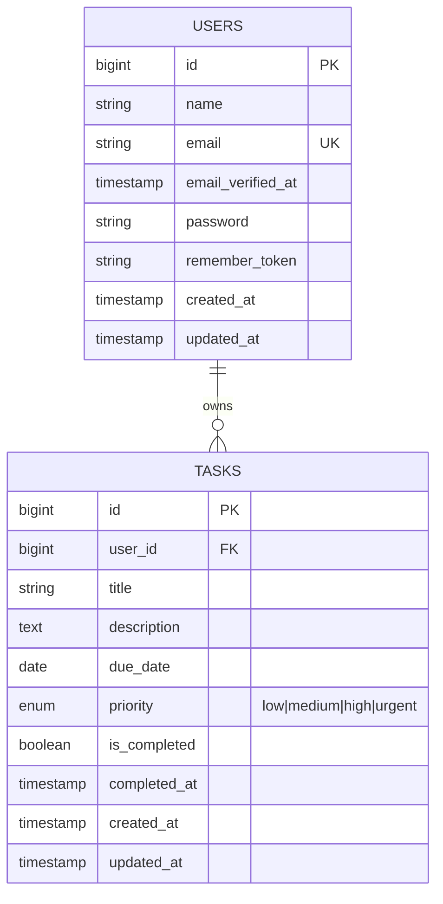
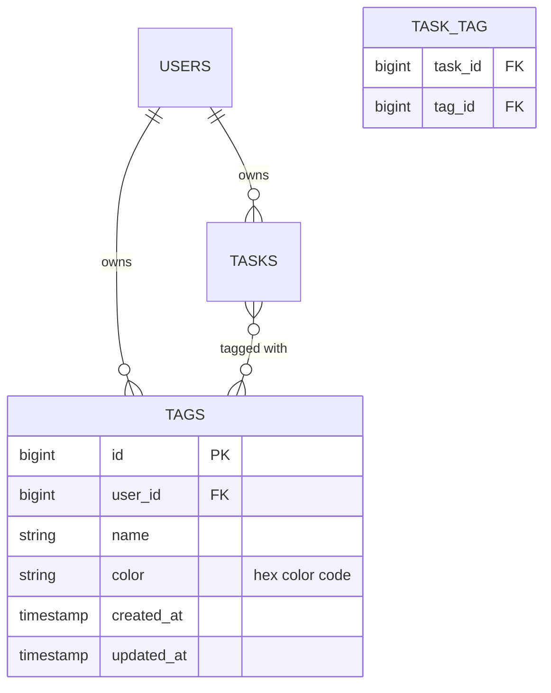

# FlowDo — Product Requirements Document (PRD)

> **Version:** 1.1  
> **Date:** 2026-05-19  
> **Status:** ✅ Approved

---

## 1. Executive Summary

**FlowDo** is a task management web application enabling users to create, track, and complete daily tasks with priority management and due-date alerts. The system uses an **Adaptive Design** approach — serving distinct, platform-optimized UI/UX for smartphone, tablet, and desktop — rather than traditional responsive design.

### Tech Stack

> **Note on Development Phase:** The frontend application currently runs on a client-side mock architecture using VueUse `useLocalStorage` for user state and task persistence. Backend specifications (Sanctum, Laravel, PostgreSQL, Docker) are documented here as integration targets for the upcoming production phase.

| Layer | Technology | Version | Status |
|-------|-----------|---------|--------|
| Frontend Framework | Vue.js (Composition API + `<script setup>`) | 3.x | Integrated |
| CSS Framework | Tailwind CSS | v4 | Integrated (using `@tailwindcss/vite`) |
| State Management | Pinia | Latest | Integrated (Mocked via Local Storage) |
| Router | Vue Router | Latest | Integrated |
| HTTP Client | Axios | Latest | Prepared |
| Backend Framework | Laravel | 13.x | Integration target |
| Authentication | Laravel Sanctum (SPA cookie-based) | Latest | Integration target |
| Database | PostgreSQL | 16+ | Integration target |
| Containerization | Docker + Docker Compose | Production only | Production setup |
| Build Tool | Vite | Latest | Integrated |

---

## 2. User Stories & Acceptance Criteria

### US-01: Authentication

> *As a User, I can login and logout from the web app.*

| # | Acceptance Criteria |
|---|---------------------|
| AC-01 | User can register with email + password |
| AC-02 | User can login with email + password and receive session cookie |
| AC-03 | User can logout; session is invalidated server-side |
| AC-04 | Unauthenticated users are redirected to `/login` |
| AC-05 | Auth state persists across page reloads via Sanctum cookie |
| AC-06 | Form validation with clear error messages (email format, password min 8 chars) |

### US-02: Task Management (CRUD)

> *As a User, I can enter my tasks, due dates, and priorities so that I can view them later.*

| # | Acceptance Criteria |
|---|---------------------|
| AC-07 | User can create a task with: title (required), description (optional), due date (required), priority (required: Low/Medium/High/Urgent), tags (optional) |
| AC-08 | Task is persisted to PostgreSQL and immediately visible in the task list |
| AC-09 | User can edit any of their own tasks |
| AC-10 | User can delete a task with confirmation dialog |
| AC-11 | Each task belongs exclusively to the authenticated user |
| AC-12b | User can assign one or more tags to a task |
| AC-13b | User can create custom tags with name and color |
| AC-14b | User can filter tasks by tag |

### US-03: Task Viewing & Completion

> *As a User, I can view all previously entered tasks and mark those that have been completed.*

| # | Acceptance Criteria |
|---|---------------------|
| AC-12 | Task list displays all user's tasks with title, due date, priority badge, and status |
| AC-13 | User can toggle task completion with a single click/tap |
| AC-14 | Completed tasks are visually distinct (strikethrough + muted styling) |
| AC-15 | User can filter: All / Active / Completed |

### US-04: Task Sorting

> *As a User, I can sort the tasks by due date, description, and priority in the UI.*

| # | Acceptance Criteria |
|---|---------------------|
| AC-16 | Sortable columns: Due Date, Title/Description, Priority |
| AC-17 | Each column toggles ASC ↔ DESC on click |
| AC-18 | Active sort indicator (arrow icon) shown on current sort column |
| AC-19 | Sorting is performed client-side for instant feedback |

### US-05: Due Date Alerts & Push Notifications

> *As a User, I want to be alerted to any tasks due today so I can perform them now.*

| # | Acceptance Criteria |
|---|---------------------|
| AC-20 | On login/dashboard load, a toast/banner shows count of tasks due today |
| AC-21 | Tasks due today are highlighted with a visual indicator (e.g., red badge) |
| AC-22 | A dedicated "Due Today" filter/quick-access button is available |
| AC-23 | Overdue tasks (past due date, not completed) are styled with warning state |
| AC-24b | Browser push notification permission prompt on first login |
| AC-25b | Daily push notification at configurable time (default 08:00) for tasks due today |
| AC-26b | User can enable/disable push notifications in settings |

### US-06: Adaptive Multi-Platform UI

> *As a User, I can access the web using mobile, tablet, or desktop with corresponding UI/UX.*

| # | Acceptance Criteria |
|---|---------------------|
| AC-24 | Three distinct layout components: Mobile, Tablet, Desktop |
| AC-25 | Platform detection at app mount determines which layout renders |
| AC-26 | Each layout has optimized interactions (touch vs. pointer) |
| AC-27 | User can force a layout via settings (override auto-detection) |

---

## 3. Architecture Overview

### 3.1 System Architecture

```
┌──────────────────────────────────────────────────────────�
│                      Client Browser                       │
│  ┌─────────────�  ┌─────────────�  ┌─────────────�      │
│  │   Mobile     │  │   Tablet    │  │  Desktop    │      │
│  │   Layout     │  │   Layout    │  │  Layout     │      │
│  └──────┬──────┘  └──────┬──────┘  └──────┬──────┘      │
│         └────────────────┼────────────────┘              │
│                    ┌─────┴─────�                         │
│                    │  Vue App  │                          │
│                    │  + Pinia  │                          │
│                    └─────┬─────┘                         │
└──────────────────────────┼───────────────────────────────┘
                           │ HTTP (Sanctum Cookie)
┌──────────────────────────┼───────────────â### 3.2 Frontend Architecture (Vue.js 3)

```
flowdo-frontend/
├── public/
├── src/
│   ├── main.ts
│   ├── App.vue
│   ├── env.d.ts
│   ├── assets/
│   │   └── styles/
│   │       ├── main.css              # Tailwind CSS v4 entry
│   │       ├── paper.css             # Elevated cards & status badges styling
│   │       └── transitions.css       # Page/Modal animations
│   ├── router/
│   │   └── index.ts                  # Vue Router config (nested /auth, dashboard, settings)
│   ├── stores/                       # Pinia stores (Mocked with local storage persistence)
│   │   ├── __tests__/                # Stores unit tests
│   │   │   ├── auth.store.spec.ts
│   │   │   └── task.store.spec.ts
│   │   ├── auth.store.ts
│   │   └── task.store.ts
│   ├── composables/                  # Shared reactive logic
│   │   ├── __tests__/                # Composables unit tests
│   │   │   ├── useDeviceDetection.spec.ts
│   │   │   └── useTheme.spec.ts
│   │   ├── useDeviceDetection.ts
│   │   ├── useDueDateAlert.ts
│   │   ├── useTaskSorting.ts
│   │   └── useTheme.ts
│   ├── types/                        # TypeScript interfaces
│   │   ├── auth.types.ts
│   │   ├── tag.types.ts
│   │   └── task.types.ts
│   ├── layouts/                      # Adaptive layouts
│   │   ├── AdaptiveRoot.vue          # Platform switcher component
│   │   ├── AuthLayout.vue            # Centered paper card layout for auth
│   │   ├── mobile/
│   │   │   ├── MobileBottomNav.vue
│   │   │   ├── MobileHeader.vue
│   │   │   └── MobileLayout.vue
│   │   ├── tablet/
│   │   │   ├── TabletLayout.vue
│   │   │   └── TabletSidebar.vue
│   │   └── desktop/
│   │       ├── DesktopLayout.vue
│   │       ├── DesktopSidebar.vue
│   │       └── DesktopTopbar.vue
│   ├── features/                     # Feature modules
│   │   ├── auth/
│   │   │   └── views/
│   │   │       ├── LoginView.vue
│   │   │       └── RegisterView.vue
│   │   ├── settings/
│   │   │   └── views/
│   │   │       └── SettingsView.vue  # App theme & platform overrides controller
│   │   └── tasks/
│   │       ├── views/
│   │       │   ├── AddTaskView.vue
│   │       │   ├── EditTaskView.vue
│   │       │   ├── TaskDashboard.vue
│   │       │   └── TodayTasksView.vue
│   │       └── components/
│   │           └── shared/           # Shared components between platforms
│   │               ├── ConfirmDialog.vue
│   │               ├── DueTodayBanner.vue
│   │               ├── TagManagerModal.vue
│   │               ├── TaskCard.vue
│   │               ├── TaskPriorityBadge.vue
│   │               └── TaskSortControls.vue
│   └── utils/                        # Validation & Date utilities
│       ├── date.utils.ts
│       └── validation.utils.ts
├── index.html
├── vite.config.ts
├── tsconfig.app.json
├── tsconfig.json
├── tsconfig.node.json
└── package.json
```yout.vue
│   │   │   └── TabletSidebar.vue
│   │   └── desktop/
│   │       ├── DesktopLayout.vue
│   │       ├── DesktopSidebar.vue
│   │       └── DesktopTopbar.vue
│   ├── features/                     # Feature modules
│   │   ├── auth/
│   │   │   ├── views/
│   │   │   │   ├── LoginView.vue
│   │   │   │   └── RegisterView.vue
│   │   │   └── components/
│   │   │       └── AuthForm.vue
│   │   └── tasks/
│   │       ├── views/
│   │       │   └── TaskDashboard.vue
│   │       └── components/
│   │           ├── mobile/
│   │           │   ├── TaskListMobile.vue
│   │           │   └── TaskFormMobile.vue
│   │           ├── tablet/
│   │           │   ├── TaskListTablet.vue
│   │           │   └── TaskFormTablet.vue
│   │           ├── desktop/
│   │           │   ├── TaskTableDesktop.vue
│   │           │   └── TaskFormDesktop.vue
│   │           └── shared/
│   │               ├── TaskCard.vue
│   │               ├── TaskPriorityBadge.vue
│   │               ├── DueTodayBanner.vue
│   │               └── TaskSortControls.vue
│   └── utils/
│       ├── date.utils.ts
│       └── validation.utils.ts
├── index.html
├── vite.config.ts
├── tailwind.config.ts
├── tsconfig.json
├── package.json
├── Dockerfile                        # Production only
└── nginx.conf                        # Production only
```

### 3.3 Backend Architecture (Laravel 13)

```
flowdo-backend/
├── app/
│   ├── Http/
│   │   ├── Controllers/
│   │   │   └── Api/
│   │   │       ├── AuthController.php
│   │   │       └── TaskController.php       # API Resource Controller
│   │   ├── Requests/
│   │   │   ├── LoginRequest.php
│   │   │   ├── RegisterRequest.php
│   │   │   ├── StoreTaskRequest.php
│   │   │   └── UpdateTaskRequest.php
│   │   └── Resources/
│   │       ├── TaskResource.php
│   │       └── TaskCollection.php
│   ├── Models/
│   │   ├── User.php
│   │   └── Task.php
│   ├── Enums/
│   │   └── TaskPriority.php                # Backed Enum (string)
│   └── Policies/
│       └── TaskPolicy.php                  # Authorization
├── database/
│   ├── migrations/
│   │   ├── xxxx_create_users_table.php
│   │   └── xxxx_create_tasks_table.php
│   ├── factories/
│   │   └── TaskFactory.php
│   └── seeders/
│       └── TaskSeeder.php
├── routes/
│   ├── api.php
│   └── web.php
├── tests/
│   └── Feature/
│       ├── AuthTest.php
│       └── TaskTest.php
├── Dockerfile                               # Production only
├── docker-compose.yml                       # Full stack
└── .env.example
```

---

## 4. Database Design

### 4.1 Entity Relationship



### 4.2 Migration: `tasks` Table

```php
Schema::create('tasks', function (Blueprint $table) {
    $table->id();
    $table->foreignId('user_id')->constrained()->cascadeOnDelete();
    $table->string('title', 255);
    $table->text('description')->nullable();
    $table->date('due_date');
    $table->string('priority', 10)->default('medium'); // low, medium, high, urgent
    $table->boolean('is_completed')->default(false);
    $table->timestamp('completed_at')->nullable();
    $table->timestamps();

    // Indexes
    $table->index(['user_id', 'due_date']);
    $table->index(['user_id', 'is_completed']);
    $table->index(['user_id', 'priority']);
});
```

---

## 5. API Specification

### 5.1 Authentication Endpoints

| Method | Endpoint | Description | Auth |
|--------|----------|-------------|------|
| `GET` | `/sanctum/csrf-cookie` | Initialize CSRF cookie | No |
| `POST` | `/api/register` | Register new user | No |
| `POST` | `/api/login` | Login (session cookie) | No |
| `POST` | `/api/logout` | Logout | Yes |
| `GET` | `/api/user` | Get authenticated user | Yes |

### 5.2 Task Endpoints (RESTful)

| Method | Endpoint | Description | Auth |
|--------|----------|-------------|------|
| `GET` | `/api/tasks` | List all user tasks | Yes |
| `POST` | `/api/tasks` | Create a task | Yes |
| `GET` | `/api/tasks/{id}` | Get single task | Yes |
| `PUT` | `/api/tasks/{id}` | Update a task | Yes |
| `DELETE` | `/api/tasks/{id}` | Delete a task | Yes |
| `PATCH` | `/api/tasks/{id}/toggle` | Toggle completion | Yes |
| `GET` | `/api/tasks/due-today` | Get tasks due today | Yes |

### 5.3 Request/Response Examples

**POST `/api/tasks`**
```json
// Request
{
  "title": "Complete PRD review",
  "description": "Review and finalize the FlowDo PRD",
  "due_date": "2026-05-20",
  "priority": "high"
}

// Response (201)
{
  "data": {
    "id": 1,
    "title": "Complete PRD review",
    "description": "Review and finalize the FlowDo PRD",
    "due_date": "2026-05-20",
    "priority": "high",
    "is_completed": false,
    "completed_at": null,
    "created_at": "2026-05-19T08:00:00Z",
    "updated_at": "2026-05-19T08:00:00Z"
  }
}
```

**GET `/api/tasks`**
```json
// Response (200)
{
  "data": [
    {
      "id": 1,
      "title": "Complete PRD review",
      "description": "...",
      "due_date": "2026-05-20",
      "priority": "high",
      "is_completed": false,
      "completed_at": null,
      "created_at": "2026-05-19T08:00:00Z",
      "updated_at": "2026-05-19T08:00:00Z"
    }
  ],
  "meta": {
    "due_today_count": 3
  }
}
```

---

## 6. Adaptive Design Strategy

### 6.1 Platform Detection

```typescript
// composables/useDeviceDetection.ts
type Platform = 'mobile' | 'tablet' | 'desktop';

export function useDeviceDetection() {
  const platform = ref<Platform>('desktop');
  const override = useLocalStorage<Platform | null>('flowdo-platform-override', null);

  function detect(): Platform {
    if (override.value) return override.value;
    const width = window.innerWidth;
    const isTouchDevice = 'ontouchstart' in window;

    if (width < 768 && isTouchDevice) return 'mobile';
    if (width >= 768 && width < 1024 && isTouchDevice) return 'tablet';
    return 'desktop';
  }

  onMounted(() => { platform.value = detect(); });

  return { platform, setPlatformOverride };
}
```

### 6.2 UI Differences per Platform

| Feature | Mobile | Tablet | Desktop |
|---------|--------|--------|---------|
| Navigation | Bottom tab bar | Collapsible sidebar | Fixed sidebar + topbar |
| Task List | Card stack (swipeable) | Card grid (2 columns) | Data table with sort headers |
| Task Form | Full-screen modal | Slide-in panel | Inline side panel |
| Task Actions | Swipe gestures | Context menu on long-press | Inline action buttons |
| Due Today Alert | Full-width top banner | Floating toast | Topbar notification badge + dropdown |
| Sort Controls | Dropdown select | Chip toggles | Clickable table headers |
| Touch Optimization | 48px min tap targets | 44px min tap targets | Standard pointer targets |
| Typography | 16px base | 15px base | 14px base |

### 6.3 Layout Rendering (AdaptiveRoot.vue)

```vue
<script setup lang="ts">
import { useDeviceDetection } from '@/composables/useDeviceDetection';
import MobileLayout from './mobile/MobileLayout.vue';
import TabletLayout from './tablet/TabletLayout.vue';
import DesktopLayout from './desktop/DesktopLayout.vue';

const { platform } = useDeviceDetection();

const layoutMap = {
  mobile: MobileLayout,
  tablet: TabletLayout,
  desktop: DesktopLayout,
} as const;
</script>

<template>
  <component :is="layoutMap[platform]">
    <router-view />
  </component>
</template>
```

---

## 7. Key Technical Specifications

### 7.1 TypeScript Types

```typescript
// types/task.types.ts
export type TaskPriority = 'low' | 'medium' | 'high' | 'urgent'
export type TaskStatus = 'to-do' | 'in-progress' | 'done'
export type TaskSortField = 'dueDate' | 'title' | 'priority'
export type SortDirection = 'asc' | 'desc'

export interface Task {
  id: string
  title: string
  description?: string
  status: TaskStatus
  dueDate: string
  priority: TaskPriority
  tags: string[]
}

export interface TaskCreatePayload {
  title: string
  description?: string
  dueDate: string
  priority: TaskPriority
  status: TaskStatus
  tags: string[]
}

export interface TaskSortState {
  field: TaskSortField
  direction: SortDirection
}

// types/tag.types.ts
export interface Tag {
  id: string
  name: string
  color: string
  isDefault?: boolean
}

// types/auth.types.ts
export interface User {
  id: string
  name: string
  email: string
  avatarUrl?: string
}

export interface LoginPayload {
  email: string
  password: string
}

export interface RegisterPayload {
  name: string
  email: string
  password: string
}
```

### 7.2 Pinia Store (Task)

```typescript
// stores/task.store.ts
export const useTaskStore = defineStore('tasks', () => {
  const tasks = useLocalStorage<Task[]>('flowdo_tasks', [...])
  const tags = useLocalStorage<Tag[]>('flowdo_tags', [...])

  const { sortState, sortedTasks, toggleSort } = useTaskSorting(tasks)
  const { dueTodayTasks, overdueTasks, showDueTodayToast, isOverdue, isDueToday } = useDueDateAlert(tasks)

  const addTask = (task: Omit<Task, 'id'>) => { ... }
  const updateTask = (id: string, updates: Partial<Task>) => { ... }
  const deleteTask = (id: string) => { ... }
  const toggleTaskStatus = (id: string) => { ... }
  
  const addTag = (tag: Omit<Tag, 'id'>) => { ... }
  const deleteTag = (id: string) => { ... }

  const getTasksByDate = (dateStr: string) => { ... }
  const getTasksByFilter = (filterType: string) => { ... }
  const getPriorityStats = (priority: 'low' | 'medium' | 'high' | 'urgent') => { ... }
  const dailyProgress = computed(() => { ... })
  const dueTodayCount = computed(() => dueTodayTasks.value.length)

  return {
    tasks,
    tags,
    sortState,
    sortedTasks,
    overdueTasks,
    dueTodayTasks,
    dueTodayCount,
    dailyProgress,
    addTask,
    updateTask,
    deleteTask,
    toggleTaskStatus,
    toggleSort,
    addTag,
    deleteTag,
    getTasksByDate,
    getTasksByFilter,
    getPriorityStats,
    showDueTodayToast,
    isOverdue,
    isDueToday
  }
})
```

### 7.3 Laravel TaskPolicy (Authorization)

```php
class TaskPolicy
{
    public function view(User $user, Task $task): bool
    {
        return $user->id === $task->user_id;
    }

    public function update(User $user, Task $task): bool
    {
        return $user->id === $task->user_id;
    }

    public function delete(User $user, Task $task): bool
    {
        return $user->id === $task->user_id;
    }
}
```

### 7.4 Laravel API Routes

```php
// routes/api.php
Route::post('/register', [AuthController::class, 'register']);
Route::post('/login', [AuthController::class, 'login']);

Route::middleware('auth:sanctum')->group(function () {
    Route::post('/logout', [AuthController::class, 'logout']);
    Route::get('/user', [AuthController::class, 'user']);

    Route::get('/tasks/due-today', [TaskController::class, 'dueToday']);
    Route::patch('/tasks/{task}/toggle', [TaskController::class, 'toggle']);
    Route::apiResource('tasks', TaskController::class);
});
```

---

## 8. Docker Configuration (Production Only)

### 8.1 docker-compose.yml

```yaml
services:
  # PostgreSQL
  db:
    image: postgres:16-alpine
    environment:
      POSTGRES_DB: flowdo
      POSTGRES_USER: flowdo_user
      POSTGRES_PASSWORD: ${DB_PASSWORD}
    volumes:
      - pgdata:/var/lib/postgresql/data
    ports:
      - "5432:5432"
    healthcheck:
      test: ["CMD-SHELL", "pg_isready -U flowdo_user -d flowdo"]
      interval: 10s
      timeout: 5s
      retries: 5

  # Laravel API
  api:
    build:
      context: ./flowdo-backend
      dockerfile: Dockerfile
    depends_on:
      db:
        condition: service_healthy
    environment:
      DB_CONNECTION: pgsql
      DB_HOST: db
      DB_PORT: 5432
      DB_DATABASE: flowdo
      DB_USERNAME: flowdo_user
      DB_PASSWORD: ${DB_PASSWORD}
      APP_KEY: ${APP_KEY}
      SANCTUM_STATEFUL_DOMAINS: ${FRONTEND_DOMAIN}
      SESSION_DOMAIN: ${SESSION_DOMAIN}
    volumes:
      - api-storage:/var/www/html/storage

  # Vue.js Frontend (Nginx)
  frontend:
    build:
      context: ./flowdo-frontend
      dockerfile: Dockerfile
    ports:
      - "80:80"
      - "443:443"
    depends_on:
      - api

  # Nginx Reverse Proxy
  nginx:
    image: nginx:alpine
    ports:
      - "80:80"
    volumes:
      - ./nginx/default.conf:/etc/nginx/conf.d/default.conf
    depends_on:
      - api
      - frontend

volumes:
  pgdata:
  api-storage:
```

### 8.2 Backend Dockerfile

```dockerfile
FROM php:8.3-fpm-alpine

RUN apk add --no-cache postgresql-dev \
    && docker-php-ext-install pdo pdo_pgsql opcache

COPY --from=composer:latest /usr/bin/composer /usr/bin/composer

WORKDIR /var/www/html
COPY . .

RUN composer install --no-dev --optimize-autoloader \
    && php artisan config:cache \
    && php artisan route:cache \
    && php artisan view:cache

EXPOSE 9000
CMD ["php-fpm"]
```

### 8.3 Frontend Dockerfile

```dockerfile
FROM node:22-alpine AS build
WORKDIR /app
COPY package*.json ./
RUN npm ci
COPY . .
RUN npm run build

FROM nginx:alpine
COPY --from=build /app/dist /usr/share/nginx/html
COPY nginx.conf /etc/nginx/conf.d/default.conf
EXPOSE 80
```

---

## 9. Security Requirements

| Requirement | Implementation |
|-------------|---------------|
| CSRF Protection | Sanctum CSRF cookie (`/sanctum/csrf-cookie`) |
| XSS Prevention | Vue auto-escaping + CSP headers |
| SQL Injection | Eloquent ORM parameterized queries |
| Authorization | TaskPolicy — users access only their own tasks |
| Password Hashing | `bcrypt` via Laravel `Hash` facade |
| Input Validation | FormRequest classes with strict rules |
| CORS | Laravel CORS config for frontend domain only |
| Rate Limiting | Laravel throttle middleware on auth routes |

---

## 10. Non-Functional Requirements

| Category | Requirement |
|----------|-------------|
| Performance | Task list renders < 200ms for up to 500 tasks |
| Performance | API response time < 300ms (p95) |
| Accessibility | WCAG 2.1 AA compliance (keyboard nav, ARIA labels) |
| Browser Support | Chrome 120+, Firefox 120+, Safari 17+, Edge 120+ |
| Mobile Support | iOS Safari 17+, Chrome Android 120+ |
| i18n Ready | Use Vue i18n plugin structure (English default) |
| Testing | Unit tests (Vitest), E2E tests (Cypress/Playwright) |
| Testing (BE) | PHPUnit feature tests for all API endpoints |

---

## 11. Development Phases

### Phase 1 — Foundation (Week 1-2)
- [ ] Project scaffolding (Vite + Vue 3 + TypeScript)
- [ ] Tailwind CSS v4 configuration
- [ ] Laravel project setup with Sanctum
- [ ] PostgreSQL database + migrations
- [ ] Auth API endpoints + Pinia auth store
- [ ] Login/Register views (all 3 platforms)

### Phase 2 — Core Features (Week 3-4)
- [ ] Task CRUD API (controller, requests, resources, policy)
- [ ] Task Pinia store with computed filters/sorting
- [ ] Desktop task table with sort headers
- [ ] Tablet task grid with card layout
- [ ] Mobile task card stack with swipe actions
- [ ] Task form (create/edit) per platform

### Phase 3 — Alerts & Polish (Week 5)
- [ ] Due today detection composable
- [ ] Alert components per platform (banner/toast/badge)
- [ ] Overdue task visual indicators
- [ ] Completion toggle with optimistic UI update
- [ ] Loading skeletons and error states

### Phase 4 — Testing & Deployment (Week 6)
- [ ] Vitest unit tests for stores and composables
- [ ] Playwright E2E tests for critical flows
- [ ] PHPUnit feature tests for API
- [ ] Docker configuration and production build
- [ ] CI/CD pipeline setup
- [ ] Performance audit and optimization

---

## 12. Resolved Decisions

| # | Question | Decision |
|---|----------|----------|
| 1 | Tailwind CSS Version | **v4** |
| 2 | Laravel Version | **13.x** (latest) |
| 3 | Pagination | Load all client-side; paginate if > 500 tasks |
| 4 | Dark Mode | **Yes** — Tailwind `dark:` variant with user toggle |
| 5 | Notifications | **In-app alerts + Browser Push Notifications** (Web Push API + Service Worker) |
| 6 | Registration | **Open self-registration** |
| 7 | Task Tags | **Yes** — optional tags with name + color |
| 8 | Backend Repo | **Separate repo** (`flowdo-backend`) |
| 9 | Deployment | **VPS** with Docker Compose |
| 10 | Platform Override | **Yes** — auto-detect by default, manual override in settings |

---

## 13. Push Notification Architecture

### Recommended Stack

| Layer | Technology | Purpose |
|-------|-----------|----------|
| Frontend | **Web Push API** + Service Worker | Subscribe, receive & display push notifications |
| Backend | **laravel-notification-channels/webpush** | Send push notifications from Laravel |
| Protocol | **VAPID** (Voluntary Application Server Identification) | Key-based server authentication |

### Flow

```
1. User logs in → Frontend requests Notification.permission
2. If granted → Service Worker registers PushSubscription
3. PushSubscription (endpoint + keys) sent to Laravel API → stored in DB
4. Laravel scheduled job runs daily at user's configured time:
   - Query tasks WHERE due_date = today AND is_completed = false
   - If count > 0 → send WebPush notification via stored subscription
5. Service Worker receives push event → displays native OS notification
```

### Backend: New Files

- `app/Notifications/TasksDueTodayNotification.php` — WebPush notification class
- `app/Console/Commands/SendDueTaskReminders.php` — Artisan scheduled command
- `database/migrations/xxxx_create_push_subscriptions_table.php`
- API endpoint: `POST /api/push-subscriptions` (store subscription)
- API endpoint: `DELETE /api/push-subscriptions` (unsubscribe)

### Frontend: New Files

- `public/sw.js` — Service Worker for push event handling
- `src/composables/usePushNotification.ts` — Subscribe/unsubscribe logic
- `src/services/push.service.ts` — API calls for subscription management

---

## 14. Task Tags/Categories Design

### Database



### Migration: `tags` + `task_tag`

```php
// tags table
Schema::create('tags', function (Blueprint $table) {
    $table->id();
    $table->foreignId('user_id')->constrained()->cascadeOnDelete();
    $table->string('name', 50);
    $table->string('color', 7)->default('#6366f1'); // hex
    $table->timestamps();
    $table->unique(['user_id', 'name']);
});

// pivot table
Schema::create('task_tag', function (Blueprint $table) {
    $table->foreignId('task_id')->constrained()->cascadeOnDelete();
    $table->foreignId('tag_id')->constrained()->cascadeOnDelete();
    $table->primary(['task_id', 'tag_id']);
});
```

### API Endpoints (Tags)

| Method | Endpoint | Description |
|--------|----------|-------------|
| `GET` | `/api/tags` | List user's tags |
| `POST` | `/api/tags` | Create tag |
| `PUT` | `/api/tags/{id}` | Update tag |
| `DELETE` | `/api/tags/{id}` | Delete tag |

---

## 15. Dark Mode Implementation

### Strategy

- Use Tailwind CSS v4 `dark:` variant with **class-based** toggling
- Store preference in `localStorage` with key `flowdo-theme`
- Default: follow system preference (`prefers-color-scheme`)
- User can override: Light / Dark / System

### Composable

```typescript
// composables/useTheme.ts
export type Theme = 'light' | 'dark' | 'system';

export function useTheme() {
  const preference = useLocalStorage<Theme>('flowdo-theme', 'system');

  const isDark = computed(() => {
    if (preference.value === 'system') {
      return window.matchMedia('(prefers-color-scheme: dark)').matches;
    }
    return preference.value === 'dark';
  });

  watchEffect(() => {
    document.documentElement.classList.toggle('dark', isDark.value);
  });

  return { preference, isDark, setTheme: (t: Theme) => preference.value = t };
}
```

### Design Tokens (Tailwind v4 CSS)

```css
/* main.css */
@import "tailwindcss";
@import "./paper.css";
@import "./transitions.css";

@theme {
  /* Fonts */
  --font-heading: "Lexend Deca", "Poppins", sans-serif;
  --font-body: "Lexend Deca", "Poppins", sans-serif;
  --font-mono: "JetBrains Mono", "Courier New", monospace;

  /* Colors - Light Mode (Figma Task App Style) */
  --color-surface: #F5F7FB;
  --color-surface-elevated: #FFFFFF;
  --color-border: #EAEAEF;
  --color-text-primary: #24252C;
  --color-text-secondary: #6E6A7C;
  --color-accent: #5F33E1; /* Figma primary violet */
  --color-danger: #FF7D53;
  --color-success: #7FFCAA;
  --color-warning: #FFD12E;

  /* Custom Category & Tag Accent Palette */
  --color-category-blue: #E7F3FF;
  --color-category-pink: #FFE4F2;
  --color-category-purple: #EDE4FF;
  --color-category-orange: #FFE6D4;
  --color-category-yellow: #FFF6D4;

  /* Default shadows */
  --shadow-sm: 0 1px 2px 0 rgb(0 0 0 / 0.05);
  --shadow: 0 1px 3px 0 rgb(0 0 0 / 0.1), 0 1px 2px -1px rgb(0 0 0 / 0.1);
  --shadow-md: 0 4px 6px -1px rgb(0 0 0 / 0.05), 0 2px 4px -2px rgb(0 0 0 / 0.05);
}

.dark {
  /* Colors - Dark Mode (Modern Slate Journal) */
  --color-surface: #131418;
  --color-surface-elevated: #1E1F25;
  --color-border: #2E2F37;
  --color-text-primary: #F5F3FF;
  --color-text-secondary: #9E9CAB;
  --color-accent: #8764FF; /* Lighter violet for readability on dark */
  --color-danger: #FF7D53;
  --color-success: #7FFCAA;
  --color-warning: #FFD12E;
}
```
