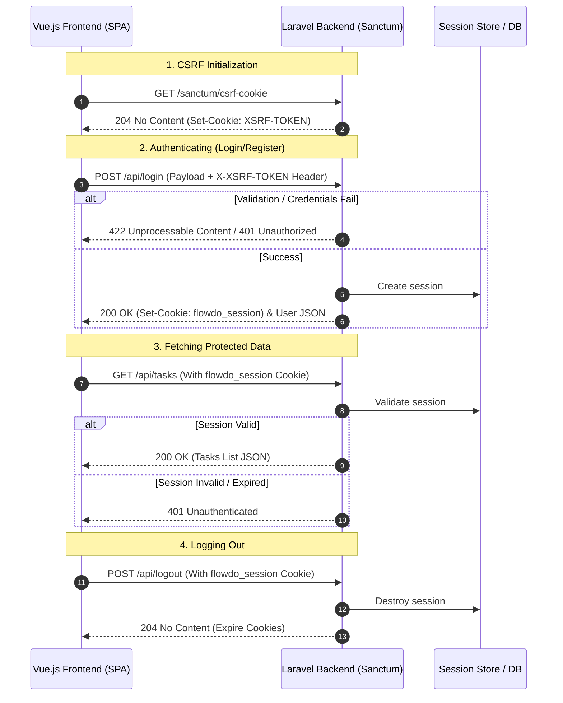

# Authentication & Authorization Flow

Dokumentasi ini menjelaskan implementasi sistem autentikasi stateful SPA (Single Page Application) menggunakan **Laravel Sanctum**. Sistem ini mengandalkan cookie berbasis sesi daripada token API (seperti JWT atau Oauth token) untuk keamanan optimal terhadap serangan XSS.

---

## 1. Sanctum SPA Authentication Lifecycle

Laravel Sanctum menggunakan cookie enkripsi Laravel untuk mengotentikasi request dari SPA. Di bawah ini adalah diagram urutan request autentikasi:



---

## 2. Inisialisasi Cookie CSRF

Sebelum SPA mengirimkan request login atau register, SPA wajib melakukan request ke `/sanctum/csrf-cookie`. Langkah ini menetapkan cookie `XSRF-TOKEN` yang kemudian akan secara otomatis dibaca oleh library HTTP client (seperti Axios) dan dikirim kembali sebagai header `X-XSRF-TOKEN` pada request berikutnya.

### Frontend Integration (Axios Setup)
```typescript
import axios from 'axios';

axios.defaults.withCredentials = true;
axios.defaults.baseURL = 'http://localhost:8000'; // Backend API URL

// Memastikan CSRF diinisialisasi sebelum action auth
export async function initializeCsrf() {
    await axios.get('/sanctum/csrf-cookie');
}
```

---

## 3. Spesifikasi Auth Controller

Semua logika autentikasi ditangani oleh `App\Http\Controllers\Api\AuthController`.

### 3.1 Registrasi Pengguna (`POST /api/register`)
Mendaftarkan akun baru, melakukan auto-login (membuat sesi), menginisialisasi default tags untuk pengguna baru, dan mengembalikan data pengguna.

- **Request Payload (`RegisterRequest`):**
  ```json
  {
    "name": "Hari Saputra",
    "email": "hari.saputra.dev@gmail.com",
    "password": "supersecurepassword123",
    "password_confirmation": "supersecurepassword123"
  }
  ```
- **Fungsi Controller:**
  ```php
  public function register(RegisterRequest $request): JsonResponse
  {
      $validated = $request->validated();
      
      $user = User::create([
          'name' => $validated['name'],
          'email' => $validated['email'],
          'password' => Hash::make($validated['password']),
      ]);

      // Inisialisasi default tags untuk user baru
      $this->initializeDefaultTags($user);

      Auth::login($user);

      return (new UserResource($user))
          ->response()
          ->setStatusCode(201);
  }
  
  private function initializeDefaultTags(User $user): void
  {
      $defaultTags = [
          ['name' => 'Work', 'color' => '#8764FF', 'is_default' => true],
          ['name' => 'Personal', 'color' => '#FF7D53', 'is_default' => true],
          ['name' => 'Study', 'color' => '#2555FF', 'is_default' => true],
          ['name' => 'Fitness', 'color' => '#F478B8', 'is_default' => true],
      ];

      foreach ($defaultTags as $tag) {
          $user->tags()->create($tag);
      }
  }
  ```

### 3.2 Login Pengguna (`POST /api/login`)
Melakukan autentikasi menggunakan email dan password, meregenerasi session ID untuk menghindari session fixation, dan mengembalikan data pengguna.

- **Request Payload (`LoginRequest`):**
  ```json
  {
    "email": "hari.saputra.dev@gmail.com",
    "password": "supersecurepassword123"
  }
  ```
- **Fungsi Controller:**
  ```php
  public function login(LoginRequest $request): JsonResponse
  {
      $request->authenticate();

      $request->session()->regenerate();

      return response()->json(new UserResource(Auth::user()));
  }
  ```

### 3.3 Logout Pengguna (`POST /api/logout`)
Membatalkan sesi autentikasi pengguna secara server-side dan menghapus cookie sesi di browser.

- **Fungsi Controller:**
  ```php
  public function logout(Request $request): Response
  {
      Auth::guard('web')->logout();

      $request->session()->invalidate();

      $request->session()->regenerateToken();

      return response()->noContent();
  }
  ```

### 3.4 Ambil Data Pengguna Sedang Login (`GET /api/user`)
Mengembalikan informasi pengguna yang sedang login saat ini (digunakan saat app mount untuk reload session).

- **Fungsi Controller:**
  ```php
  public function user(Request $request): UserResource
  {
      return new UserResource($request->user());
  }
  ```

---

## 4. Validasi FormRequest

Aturan validasi didefinisikan secara deklaratif di class FormRequest masing-masing:

### 4.1 `RegisterRequest`
```php
namespace App\Http\Requests;

use Illuminate\Foundation\Http\FormRequest;

class RegisterRequest extends FormRequest
{
    public function authorize(): bool
    {
        return true;
    }

    public function rules(): array
    {
        return [
            'name' => ['required', 'string', 'max:255'],
            'email' => ['required', 'string', 'email', 'max:255', 'unique:users'],
            'password' => ['required', 'string', 'min:8', 'confirmed'],
        ];
    }
}
```

### 4.2 `LoginRequest`
```php
namespace App\Http\Requests;

use Illuminate\Auth\Events\Lockout;
use Illuminate\Foundation\Http\FormRequest;
use Illuminate\Support\Facades\Auth;
use Illuminate\Support\Facades\RateLimiter;
use Illuminate\Support\Str;
use Illuminate\Validation\ValidationException;

class LoginRequest extends FormRequest
{
    public function authorize(): bool
    {
        return true;
    }

    public function rules(): array
    {
        return [
            'email' => ['required', 'string', 'email'],
            'password' => ['required', 'string'],
        ];
    }

    public function authenticate(): void
    {
        $this->ensureIsNotRateLimited();

        if (!Auth::attempt($this->only('email', 'password'), $this->boolean('remember'))) {
            RateLimiter::hit($this->throttleKey());

            throw ValidationException::withMessages([
                'email' => __('auth.failed'),
            ]);
        }

        RateLimiter::clear($this->throttleKey());
    }

    protected function ensureIsNotRateLimited(): void
    {
        if (!RateLimiter::tooManyAttempts($this->throttleKey(), 5)) {
            return;
        }

        event(new Lockout($this));

        $seconds = RateLimiter::availableIn($this->throttleKey());

        throw ValidationException::withMessages([
            'email' => trans('auth.throttle', [
                'seconds' => $seconds,
                'minutes' => ceil($seconds / 60),
            ]),
        ]);
    }

    protected function throttleKey(): string
    {
        return Str::transliterate(Str::lower($this->input('email')).'|'.$this->ip());
    }
}
```

---

## 5. Format Respon Error Validasi (Unprocessable Content - 422)

Saat validasi gagal, API akan merespon dengan status code `422` dan format JSON standard Laravel yang dapat langsung dikonsumsi oleh UI untuk menampilkan error per input field:

```json
{
  "message": "The email has already been taken. (and 1 other error)",
  "errors": {
    "email": [
      "The email has already been taken."
    ],
    "password": [
      "The password field confirmation does not match."
    ]
  }
}
```

---

## 6. Konfigurasi Sesi & Sanctum

Agar autentikasi stateful SPA berjalan dengan baik, pastikan file konfigurasi backend disesuaikan sebagai berikut:

### 6.1 `bootstrap/app.php`
Mengaktifkan stateful API middleware untuk mengenali request berbasis sesi dari host SPA.
```php
use Illuminate\Foundation\Application;
use Illuminate\Foundation\Configuration\Middleware;

return Application::configure(basename(__DIR__))
    ->withMiddleware(function (Middleware $middleware) {
        $middleware->statefulApi();
    })
    // ...
```

### 6.2 Konfigurasi Cookie (`.env`)
```env
SESSION_DRIVER=cookie
SESSION_LIFETIME=120
SESSION_SECURE_COOKIE=true
SESSION_SAME_SITE=lax
```
- `SESSION_DRIVER` diatur ke `cookie` atau `database`.
- `SESSION_SECURE_COOKIE` harus bernilai `true` di lingkungan produksi (HTTPS) agar cookie tidak dapat disadap.
- `SESSION_SAME_SITE` diatur ke `lax` agar cookie dikirim pada navigasi lintas situs yang aman.

---

## 7. Proteksi Terhadap Serangan Keamanan (Rate Limiting)

Untuk mengamankan route autentikasi dari serangan brute force, middleware `throttle` dipasang pada route login dan register dengan batas **5 kali percobaan per menit per alamat IP/email**.

```php
// routes/api.php
Route::post('/login', [AuthController::class, 'login'])
    ->middleware('throttle:login');

Route::post('/register', [AuthController::class, 'register'])
    ->middleware('throttle:6,1'); // Maksimal 6 request per menit
```
 Jika limit terlampaui, backend akan merespon dengan status code `429 Too Many Requests` disertai header `Retry-After`.
