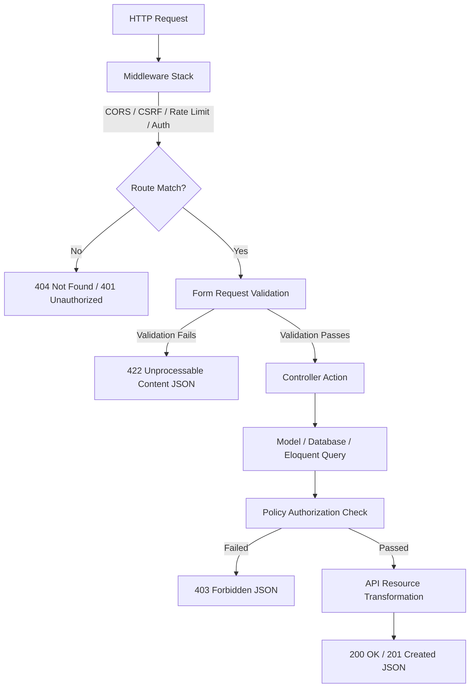

# Backend Architecture & Code Patterns

Dokumentasi ini menjelaskan struktur direktori, alur daur hidup request, arsitektur kelas (Controllers, Requests, Resources, Policies), serta standar penulisan kode (coding standards) yang digunakan dalam backend FlowDo.

---

## 1. Struktur Direktori Proyek

Backend FlowDo berbasis Laravel 13 dengan struktur direktori sebagai berikut:

```
flowdo-backend/
├── app/
│   ├── Console/
│   │   └── Commands/
│   │       └── SendDueTaskReminders.php # Command reminder harian (fase akhir)
│   ├── Enums/
│   │   ├── TaskPriority.php             # Backed Enum Priority (low, medium, etc.)
│   │   └── TaskStatus.php               # Backed Enum Status (to-do, done, etc.)
│   ├── Http/
│   │   ├── Controllers/
│   │   │   └── Api/
│   │   │       ├── AuthController.php   # Login, register, logout, get user
│   │   │       ├── TagController.php    # CRUD Tag
│   │   │       └── TaskController.php   # CRUD Task & custom methods
│   │   ├── Requests/
│   │   │   ├── LoginRequest.php
│   │   │   ├── RegisterRequest.php
│   │   │   ├── StoreTagRequest.php
│   │   │   ├── StoreTaskRequest.php
│   │   │   ├── UpdateTagRequest.php
│   │   │   └── UpdateTaskRequest.php
│   │   └── Resources/
│   │       ├── TagResource.php          # Transform Model Tag -> JSON
│   │       ├── TaskCollection.php       # Transform paginated Tasks
│   │       └── TaskResource.php         # Transform Model Task -> JSON
│   ├── Models/
│   │   ├── PushSubscription.php         # Web push subscription model
│   │   ├── Tag.php
│   │   ├── Task
│   │   └── User.php
│   └── Policies/
│       ├── TagPolicy.php                # Aturan otorisasi Tag
│       └── TaskPolicy.php               # Aturan otorisasi Task
├── bootstrap/
│   ├── app.php                          # Konfigurasi middleware & routes
│   └── providers.php                    # Register service providers
├── config/                              # File konfigurasi app, database, cors, dll.
├── database/
│   ├── factories/
│   │   ├── TagFactory.php
│   │   ├── TaskFactory.php
│   │   └── UserFactory.php
│   ├── migrations/
│   │   ├── 0001_01_01_000000_create_users_table.php
│   │   ├── xxxx_xx_xx_xxxxxx_create_tasks_table.php
│   │   ├── xxxx_xx_xx_xxxxxx_create_tags_table.php
│   │   ├── xxxx_xx_xx_xxxxxx_create_task_tag_table.php
│   │   └── xxxx_xx_xx_xxxxxx_create_push_subscriptions_table.php
│   └── seeders/
│       ├── DatabaseSeeder.php
│       └── TaskSeeder.php
├── routes/
│   ├── api.php                          # Rute endpoint REST API
│   └── web.php                          # Rute non-API (kosong/redirect)
└── tests/
    └── Feature/
        ├── AuthTest.php
        ├── TagTest.php
        └── TaskTest.php
```

---

## 2. Request Lifecycle (Alur Daur Hidup Request)

Setiap HTTP request yang masuk ke backend FlowDo melewati beberapa layer pemrosesan terstruktur sebelum menghasilkan respon JSON:



1. **Middleware Stack:** Memvalidasi header request, menangani CORS, inisialisasi cookie sesi Sanctum, memeriksa rate limit, dan memvalidasi kecocokan token CSRF.
2. **Form Request Validation:** Memvalidasi tipe data input, keharusan field (required), batas karakter, format email, dan kecocokan nilai enum.
3. **Policy Authorization:** Memastikan pengguna hanya memiliki hak akses penuh terhadap data miliknya sendiri (`user_id === auth()->id()`).
4. **API Resource:** Mentransformasikan object Eloquent Model beserta relasinya (seperti eager-loaded tags) menjadi payload JSON yang presisi sesuai kebutuhan frontend.

---

## 3. Komponen Arsitektur Kode

### 3.1 Controllers (`App\Http\Controllers\Api`)
Controller harus tetap tipis (skinny controllers) dan fokus mendelegasikan request ke form request, model, dan resources.

- **`AuthController`:** Menangani logic autentikasi stateful.
- **`TaskController`:** Resource controller yang menangani CRUD task, toggle status, dan filter hari ini.
  ```php
  class TaskController extends Controller
  {
      public function index(Request $request): TaskCollection
      {
          $tasks = $request->user()->tasks()
              ->with('tags')
              ->when($request->status, function ($q, $status) {
                  // status filter mapping ('todo', 'inprogress', 'completed')
                  $dbStatus = match($status) {
                      'todo' => TaskStatus::TO_DO,
                      'inprogress' => TaskStatus::IN_PROGRESS,
                      'completed' => TaskStatus::DONE,
                  };
                  return $q->where('status', $dbStatus);
              })
              ->when($request->tag, function ($q, $tagName) {
                  return $q->whereHas('tags', fn($t) => $t->where('name', $tagName));
              })
              ->orderBy(
                  $request->input('sort_by', 'due_date'), 
                  $request->input('sort_direction', 'asc')
              )
              ->get();

          return new TaskCollection($tasks);
      }

      public function store(StoreTaskRequest $request): JsonResponse
      {
          $validated = $request->validated();
          $task = $request->user()->tasks()->create($validated);

          if (!empty($validated['tags'])) {
              $tagIds = Tag::whereIn('name', $validated['tags'])
                  ->where('user_id', $request->user()->id)
                  ->pluck('id');
              $task->tags()->sync($tagIds);
          }

          return (new TaskResource($task->load('tags')))
              ->response()
              ->setStatusCode(201);
      }
      
      // show, update, destroy, toggle, dueToday...
  }
  ```

### 3.2 Form Requests (`App\Http\Requests`)
Setiap validasi input wajib dipisahkan ke dalam class FormRequest terpisah.

- **`StoreTaskRequest`:**
  ```php
  public function rules(): array
  {
      return [
          'title' => ['required', 'string', 'max:255'],
          'description' => ['nullable', 'string'],
          'dueDate' => ['required', 'date_format:Y-m-d'],
          'priority' => ['required', Rule::enum(TaskPriority::class)],
          'status' => ['nullable', Rule::enum(TaskStatus::class)],
          'tags' => ['nullable', 'array'],
          'tags.*' => ['string'],
      ];
  }

  protected function prepareForValidation(): void
  {
      // Melakukan konversi format camelCase dari frontend ke snake_case database
      if ($this->has('dueDate')) {
          $this->merge(['due_date' => $this->dueDate]);
      }
  }
  ```

### 3.3 API Resources (`App\Http\Resources`)
API Resource bertugas mencocokkan camelCase format pada JavaScript frontend dan melakukan conversion/formatting data.

- **`TaskResource`:**
  ```php
  class TaskResource extends JsonResource
  {
      public function toArray(Request $request): array
      {
          return [
              'id' => (string) $this->id, // Frontend mengharapkan string ID
              'title' => $this->title,
              'description' => $this->description,
              'status' => $this->status->value,
              'dueDate' => $this->due_date->format('Y-m-d'),
              'priority' => $this->priority->value,
              'tags' => TagResource::collection($this->whenLoaded('tags')),
          ];
      }
  }
  ```

### 3.4 Policies (`App\Http\Policies`)
Otorisasi terpusat menggunakan model policies untuk kepatuhan SOLID.

- **`TaskPolicy`:**
  ```php
  class TaskPolicy
  {
      public function view(User $user, Task $task): bool
      {
          return $user->id === $task->user_id;
      }

      public function update(User $user, Task $task): bool
      {
          return $user->id === $task->user_id;
      }

      public function delete(User $user, Task $task): bool
      {
          return $user->id === $task->user_id;
      }
  }
  ```
  *Didaftarkan secara otomatis oleh Laravel atau manual di `AuthServiceProvider` jika nama model menyimpang.*

---

## 4. Middleware Stack

Konfigurasi middleware terpusat pada file `bootstrap/app.php` menggunakan pipeline global middleware:

```php
->withMiddleware(function (Middleware $middleware) {
    $middleware->alias([
        'auth' => \Illuminate\Auth\Middleware\Authenticate::class,
    ]);
    
    $middleware->statefulApi(); // Mengaktifkan Sanctum session guard

    $middleware->validateCsrfTokens(except: [
        // Diperlukan jika ada service luar/webhooks, auth default wajib CSRF
    ]);
})
```

---

## 5. Standar Penulisan Kode (Coding Standards)

Untuk menjaga kualitas kode selevel professional production, backend wajib mengikuti aturan berikut:

1. **PHP Version:** PHP `8.3` atau lebih tinggi.
2. **Strict Typing:** Setiap file PHP wajib menyertakan deklarasi strict types di baris pertama.
   ```php
   <?php
   declare(strict_types=1);
   ```
3. **PSR Compliance:** Mematuhi standard `PSR-12` (style guide) & `PSR-4` (autoloading).
4. **Strong Typing:** Semua fungsi wajib mendeklarasikan tipe parameter dan tipe kembalian (return types).
   ```php
   public function calculateProgress(Task $task): int
   ```
5. **Backed Enums:** Gunakan Backed Enum bertipe string untuk data status, priority, dll., guna mencegah error "magic string".
6. **Laravel Conventions:**
   - Gunakan Eloquent ORM (jangan Raw SQL kecuali sangat diperlukan untuk optimasi tingkat lanjut).
   - Penulisan routing menggunakan nama controller dengan nama method dalam array (e.g. `[TaskController::class, 'index']`).
   - Penulisan nama variabel database menggunakan `snake_case`, sedangkan JSON API output menggunakan `camelCase`.
