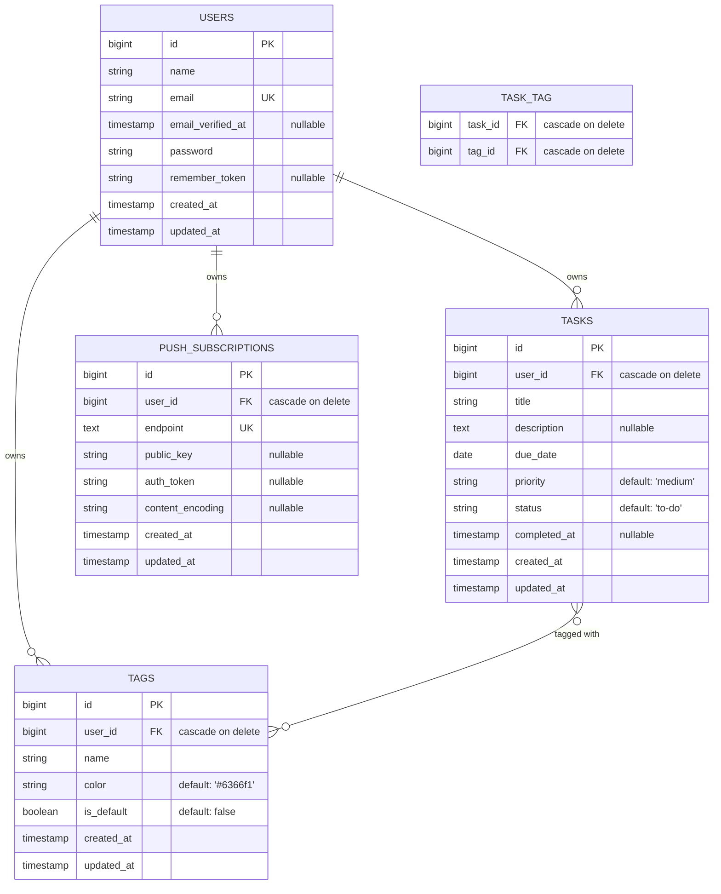

# Database Schema & Model Blueprint

Dokumentasi ini menjelaskan rancangan database PostgreSQL, migrasi Laravel, serta blueprint model Eloquent untuk aplikasi FlowDo. Skema ini telah disesuaikan agar sepenuhnya kompatibel dengan tipe data dan status di frontend.

---

## 1. Entity Relationship Diagram (ERD)

Berikut adalah relasi antar tabel dalam database FlowDo:



---

## 2. Tabel Migrasi (Migration Specifications)

### 2.1 Tabel `users`
Tabel standar untuk penyimpanan kredensial pengguna.
```php
Schema::create('users', function (Blueprint $table) {
    $table->id();
    $table->string('name');
    $table->string('email')->unique();
    $table->timestamp('email_verified_at')->nullable();
    $table->string('password');
    $table->rememberToken();
    $table->timestamps();
});
```

### 2.2 Tabel `tasks`
Mengadopsi kolom `status` bertipe string enum untuk menggantikan boolean `is_completed`.
```php
Schema::create('tasks', function (Blueprint $table) {
    $table->id();
    $table->foreignId('user_id')->constrained()->cascadeOnDelete();
    $table->string('title', 255);
    $table->text('description')->nullable();
    $table->date('due_date');
    $table->string('priority', 10)->default('medium'); // low, medium, high, urgent
    $table->string('status', 20)->default('to-do'); // to-do, in-progress, done
    $table->timestamp('completed_at')->nullable();
    $table->timestamps();

    // Indexes untuk optimasi query pemfilteran & pengurutan di Dashboard
    $table->index(['user_id', 'due_date']);
    $table->index(['user_id', 'status']);
    $table->index(['user_id', 'priority']);
});
```

### 2.3 Tabel `tags`
Menyimpan tag kustom maupun bawaan per user.
```php
Schema::create('tags', function (Blueprint $table) {
    $table->id();
    $table->foreignId('user_id')->constrained()->cascadeOnDelete();
    $table->string('name', 50);
    $table->string('color', 7)->default('#6366f1'); // Hex code format (e.g. #FFFFFF)
    $table->boolean('is_default')->default(false);
    $table->timestamps();

    // Memastikan satu user tidak memiliki tag dengan nama yang sama
    $table->unique(['user_id', 'name']);
});
```

### 2.4 Tabel `task_tag` (Pivot Table)
Relasi many-to-many antara task dan tag.
```php
Schema::create('task_tag', function (Blueprint $table) {
    $table->foreignId('task_id')->constrained()->cascadeOnDelete();
    $table->foreignId('tag_id')->constrained()->cascadeOnDelete();
    $table->primary(['task_id', 'tag_id']);
});
```

### 2.5 Tabel `push_subscriptions`
Menyimpan data browser push notification subscription (VAPID).
```php
Schema::create('push_subscriptions', function (Blueprint $table) {
    $table->id();
    $table->foreignId('user_id')->constrained()->cascadeOnDelete();
    $table->text('endpoint')->unique();
    $table->string('public_key')->nullable();
    $table->string('auth_token')->nullable();
    $table->string('content_encoding')->nullable();
    $table->timestamps();
});
```

---

## 3. Blueprint Model Eloquent

### 3.1 Model `User`
```php
namespace App\Models;

use Illuminate\Database\Eloquent\Factories\HasFactory;
use Illuminate\Foundation\Auth\User as Authenticatable;
use Illuminate\Notifications\Notifiable;
use Laravel\Sanctum\HasApiTokens;

class User extends Authenticatable
{
    use HasApiTokens, HasFactory, Notifiable;

    protected $fillable = ['name', 'email', 'password'];
    protected $hidden = ['password', 'remember_token'];

    protected function casts(): array
    {
        return [
            'email_verified_at' => 'datetime',
            'password' => 'hashed',
        ];
    }

    public function tasks()
    {
        return $this->hasMany(Task::class);
    }

    public function tags()
    {
        return $this->hasMany(Tag::class);
    }

    public function pushSubscriptions()
    {
        return $this->hasMany(PushSubscription::class);
    }
}
```

### 3.2 Model `Task`
```php
namespace App\Models;

use App\Enums\TaskPriority;
use App\Enums\TaskStatus;
use Illuminate\Database\Eloquent\Factories\HasFactory;
use Illuminate\Database\Eloquent\Model;

class Task extends Model
{
    use HasFactory;

    protected $fillable = [
        'title',
        'description',
        'due_date',
        'priority',
        'status',
        'completed_at',
    ];

    protected function casts(): array
    {
        return [
            'due_date' => 'date:Y-m-d',
            'priority' => TaskPriority::class,
            'status' => TaskStatus::class,
            'completed_at' => 'datetime',
        ];
    }

    // Relationships
    public function user()
    {
        return $this->belongsTo(User::class);
    }

    public function tags()
    {
        return $this->belongsToMany(Tag::class, 'task_tag');
    }

    // Scopes
    public function scopeDueToday($query)
    {
        return $query->where('due_date', today()->format('YYYY-MM-DD'));
    }

    public function scopeOverdue($query)
    {
        return $query->where('due_date', '<', today()->format('YYYY-MM-DD'))
                     ->where('status', '!=', TaskStatus::DONE);
    }
}
```

### 3.3 Model `Tag`
```php
namespace App\Models;

use Illuminate\Database\Eloquent\Factories\HasFactory;
use Illuminate\Database\Eloquent\Model;

class Tag extends Model
{
    use HasFactory;

    protected $fillable = ['name', 'color', 'is_default'];

    protected function casts(): array
    {
        return [
            'is_default' => 'boolean',
        ];
    }

    // Relationships
    public function user()
    {
        return $this->belongsTo(User::class);
    }

    public function tasks()
    {
        return $this->belongsToMany(Task::class, 'task_tag');
    }
}
```

---

## 4. Backed Enums (PHP 8.3+)

### 4.1 Enum `TaskPriority`
```php
namespace App\Enums;

enum TaskPriority: string
{
    case LOW = 'low';
    case MEDIUM = 'medium';
    case HIGH = 'high';
    case URGENT = 'urgent';
}
```

### 4.2 Enum `TaskStatus`
```php
namespace App\Enums;

enum TaskStatus: string
{
    case TO_DO = 'to-do';
    case IN_PROGRESS = 'in-progress';
    case DONE = 'done';
}
```

---

## 5. Sinkronisasi Type Data (Frontend ↔ Backend Mapping)

Untuk menghindari inkonsistensi data, pemetaan antara tipe TypeScript frontend dengan kolom database backend adalah sebagai berikut:

| TypeScript Interface Field | DB Column Name | PHP/Laravel Data Type | Note |
|----------------------------|----------------|-----------------------|------|
| `Task.id` (string) | `tasks.id` (bigint) | `int` | String casting dilakukan di API Resource |
| `Task.title` (string) | `tasks.title` | `string` | Max length: 255 |
| `Task.description` (string/opt)| `tasks.description`| `string` (nullable) | |
| `Task.dueDate` (string) | `tasks.due_date` | `Carbon\Carbon` (date) | Format YYYY-MM-DD |
| `Task.priority` (enum) | `tasks.priority` | `App\Enums\TaskPriority` | `low`/`medium`/`high`/`urgent` |
| `Task.status` (enum) | `tasks.status` | `App\Enums\TaskStatus` | `to-do`/`in-progress`/`done` |
| `Task.tags` (string[]) | `task_tag` relations | `App\Http\Resources\TagResource` | Dikembalikan sebagai list of Tag Objects |
| `Tag.id` (string) | `tags.id` (bigint) | `int` | String casting dilakukan di API Resource |
| `Tag.name` (string) | `tags.name` | `string` | Max length: 50 |
| `Tag.color` (string) | `tags.color` | `string` | Hex format (e.g. #FFFFFF) |
| `Tag.isDefault` (bool/opt) | `tags.is_default`| `boolean` | |

---

## 6. Seeding Specifications

Seeder database akan menginisialisasi default tags dan data sampel yang sesuai dengan data awal (prepopulated) pada frontend:

### 6.1 Default Tags Seeder
Saat pengguna baru terdaftar, system harus menginisialisasi default tags berikut khusus untuk pengguna tersebut:

| Tag Name | Color | is_default |
|----------|-------|------------|
| Work | `#8764FF` | true |
| Personal | `#FF7D53` | true |
| Study | `#2555FF` | true |
| Fitness | `#F478B8` | true |

### 6.2 Sample Tasks Seeder (Untuk Testing/Dev)
Digunakan untuk seeding lingkungan local development/test:

1. **Task 1**
   - Title: `Market Research`
   - Description: `Conduct market research and user analysis for the grocery shopping application.`
   - Status: `done`
   - Due Date: `Today`
   - Priority: `medium`
   - Tags: `['Work']`

2. **Task 2**
   - Title: `Competitive Analysis`
   - Description: `Analyze competitors in the grocery shopping space to identify gaps and features.`
   - Status: `in-progress`
   - Due Date: `Today`
   - Priority: `high`
   - Tags: `['Work']`

3. **Task 3**
   - Title: `Create Low-fidelity Wireframe`
   - Description: `Sketch out initial layout and basic structures for the Uber Eats challenge screen flow.`
   - Status: `to-do`
   - Due Date: `Today`
   - Priority: `urgent`
   - Tags: `['Personal']`

4. **Task 4**
   - Title: `How to pitch a Design Sprint`
   - Description: `Study materials and prepare slides about design sprints for the client meeting.`
   - Status: `to-do`
   - Due Date: `Tomorrow`
   - Priority: `low`
   - Tags: `['Study']`
