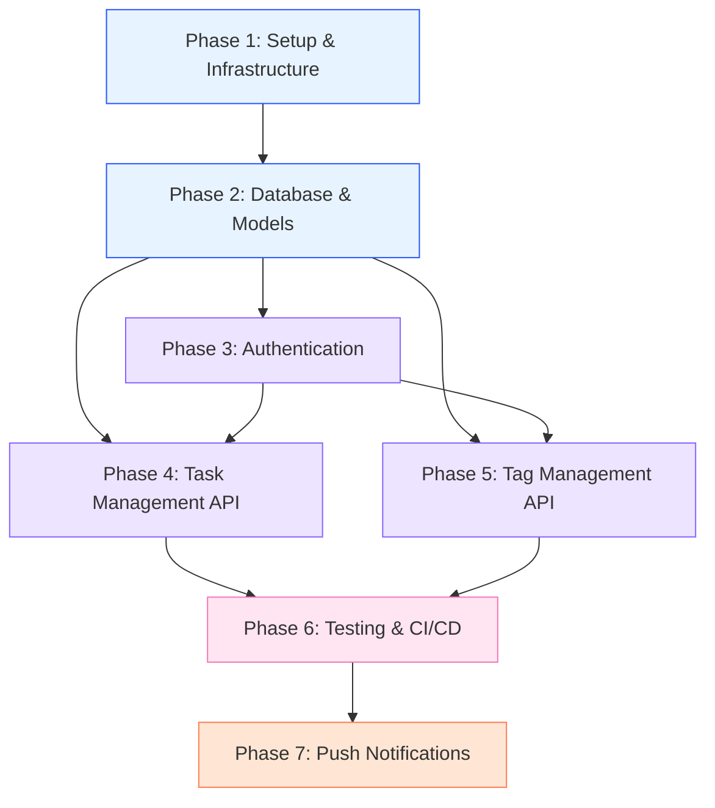

# FlowDo Backend — Development Phases

> **Sumber Referensi:**  
> - [DATABASE_SCHEMA.md](DATABASE_SCHEMA.md)  
> - [AUTHENTICATION.md](AUTHENTICATION.md)  
> - [API_REFERENCE.md](API_REFERENCE.md)  
> - [BACKEND_ARCHITECTURE.md](BACKEND_ARCHITECTURE.md)  
> - [ENVIRONMENT_CONFIG.md](ENVIRONMENT_CONFIG.md)  
> - [TESTING_STRATEGY.md](TESTING_STRATEGY.md)

---

## Overview

| Phase | Nama | Tujuan Utama | Status |
|-------|------|-------------|--------|
| 1 | Project Setup & Infrastructure | Scaffolding Laravel 13, Docker, PostgreSQL, Sanctum | ⬜ Pending |
| 2 | Database Schema & Models | Migrasi, Eloquent Models, Enums, Seeders | ⬜ Pending |
| 3 | Authentication System | Register, Login, Logout, CSRF, Rate Limiting | ⬜ Pending |
| 4 | Task Management API | CRUD Tasks, Toggle Status, Due Today, Sorting | ⬜ Pending |
| 5 | Tag Management API | CRUD Tags, Default Tags, Relasi Many-to-Many | ⬜ Pending |
| 6 | Testing & CI/CD | PHPUnit Feature Tests, Factories, GitHub Actions | ⬜ Pending |
| 7 | Push Notifications | Web Push Subscription, Scheduled Reminders | ⬜ Pending |

---

## Phase 1 — Project Setup & Infrastructure

> **Tujuan:** Menyiapkan fondasi project Laravel 13 dengan koneksi database PostgreSQL, konfigurasi Docker untuk local development, dan instalasi Laravel Sanctum sebagai authentication guard.
>
> **Ref:** [ENVIRONMENT_CONFIG.md](ENVIRONMENT_CONFIG.md), [BACKEND_ARCHITECTURE.md](BACKEND_ARCHITECTURE.md) §1

### Deliverables

| # | File / Config | Deskripsi |
|---|---------------|-----------|
| 1 | Proyek Laravel 13 | Scaffolding via `composer create-project` |
| 2 | `docker-compose.yml` | Service: PostgreSQL 16, PHP-FPM 8.3, Nginx |
| 3 | `Dockerfile` | PHP 8.3-FPM Alpine + `pdo_pgsql` extension |
| 4 | `nginx/default.conf` | Reverse proxy ke PHP-FPM |
| 5 | `.env` / `.env.example` | Database, Sanctum, Session, CORS variables |
| 6 | `config/cors.php` | Izin frontend origin + `supports_credentials: true` |
| 7 | `bootstrap/app.php` | Aktifkan `statefulApi()` middleware |

### Langkah Implementasi

1. **Scaffolding Laravel 13:**
   ```bash
   composer create-project laravel/laravel flowdo-backend
   cd flowdo-backend
   ```

2. **Install Sanctum (sudah built-in Laravel 11+, pastikan aktif):**
   ```bash
   php artisan install:api
   ```

3. **Setup Docker Compose** — Buat `docker-compose.yml` dengan 3 service:
   - `db`: PostgreSQL 16-alpine dengan healthcheck
   - `api`: PHP 8.3-FPM dengan source code di-mount
   - `webserver`: Nginx Alpine sebagai reverse proxy

4. **Konfigurasi `.env`:**
   ```env
   DB_CONNECTION=pgsql
   DB_HOST=db          # Nama service Docker
   DB_PORT=5432
   DB_DATABASE=flowdo
   DB_USERNAME=flowdo_user
   DB_PASSWORD=secret

   SANCTUM_STATEFUL_DOMAINS=localhost:5173,127.0.0.1:5173
   SESSION_DOMAIN=localhost
   SESSION_DRIVER=cookie
   ```

5. **Aktifkan Stateful API di `bootstrap/app.php`:**
   ```php
   ->withMiddleware(function (Middleware $middleware) {
       $middleware->statefulApi();
   })
   ```

6. **Konfigurasi CORS (`config/cors.php`):**
   ```php
   'paths' => ['api/*', 'sanctum/csrf-cookie'],
   'supports_credentials' => true,
   'allowed_origins' => [env('FRONTEND_URL', 'http://localhost:5173')],
   ```

7. **Buat Nginx config (`nginx/default.conf`)** dengan `fastcgi_pass api:9000`.

### Acceptance Criteria

- [ ] `docker-compose up -d` berhasil menjalankan 3 service tanpa error
- [ ] `php artisan migrate` berhasil terkoneksi ke PostgreSQL
- [ ] `GET /sanctum/csrf-cookie` mengembalikan `204` dengan `Set-Cookie: XSRF-TOKEN`
- [ ] Request dari `localhost:5173` tidak di-block oleh CORS

---

## Phase 2 — Database Schema & Models

> **Tujuan:** Membuat seluruh tabel database, mendefinisikan model Eloquent dengan relasi, dan mempersiapkan data seeder untuk development.
>
> **Ref:** [DATABASE_SCHEMA.md](DATABASE_SCHEMA.md) §2–§6

### Deliverables

| # | File | Deskripsi |
|---|------|-----------|
| 1 | `database/migrations/xxxx_create_tasks_table.php` | Migrasi tabel `tasks` |
| 2 | `database/migrations/xxxx_create_tags_table.php` | Migrasi tabel `tags` |
| 3 | `database/migrations/xxxx_create_task_tag_table.php` | Migrasi pivot table |
| 4 | `app/Models/Task.php` | Model Task + relationships + scopes |
| 5 | `app/Models/Tag.php` | Model Tag + relationships |
| 6 | `app/Models/User.php` | Update: tambah relasi `hasMany(Task)`, `hasMany(Tag)` |
| 7 | `app/Enums/TaskPriority.php` | Backed string enum (`low`, `medium`, `high`, `urgent`) |
| 8 | `app/Enums/TaskStatus.php` | Backed string enum (`to-do`, `in-progress`, `done`) |
| 9 | `database/factories/TaskFactory.php` | Factory dengan states: `completed()`, `dueToday()` |
| 10 | `database/factories/TagFactory.php` | Factory dengan state: `default()` |
| 11 | `database/seeders/DatabaseSeeder.php` | Orchestrate seeder utama |

### Langkah Implementasi

1. **Buat Migrasi:**
   ```bash
   php artisan make:migration create_tasks_table
   php artisan make:migration create_tags_table
   php artisan make:migration create_task_tag_table
   ```

2. **Definisikan kolom tabel `tasks`:**
   - `user_id` (FK, cascade delete)
   - `title` (string, max 255)
   - `description` (text, nullable)
   - `due_date` (date)
   - `priority` (string, default `medium`) — backed by `TaskPriority` enum
   - `status` (string, default `to-do`) — backed by `TaskStatus` enum (**bukan** `is_completed`)
   - `completed_at` (timestamp, nullable) — auto-set saat status → `done`
   - **Indexes:** `[user_id, due_date]`, `[user_id, status]`, `[user_id, priority]`

3. **Definisikan kolom tabel `tags`:**
   - `user_id` (FK, cascade delete)
   - `name` (string, max 50)
   - `color` (string, max 7, default `#6366f1`)
   - `is_default` (boolean, default false)
   - **Unique Constraint:** `[user_id, name]`

4. **Pivot table `task_tag`:** Composite PK `[task_id, tag_id]`, keduanya cascade on delete.

5. **Buat Backed Enums (PHP 8.3+):**
   ```php
   // app/Enums/TaskPriority.php
   enum TaskPriority: string {
       case LOW = 'low';
       case MEDIUM = 'medium';
       case HIGH = 'high';
       case URGENT = 'urgent';
   }

   // app/Enums/TaskStatus.php
   enum TaskStatus: string {
       case TO_DO = 'to-do';
       case IN_PROGRESS = 'in-progress';
       case DONE = 'done';
   }
   ```

6. **Definisikan Model Eloquent:**
   - `Task`: casts `priority` → `TaskPriority`, `status` → `TaskStatus`, `due_date` → `date:Y-m-d`
   - Scope `scopeDueToday()`, `scopeOverdue()`
   - Relasi: `belongsTo(User)`, `belongsToMany(Tag)`

7. **Buat Factories & Seeders** — Sample data harus identik dengan frontend mock data (4 task, 4 default tag).

### Acceptance Criteria

- [ ] `php artisan migrate:fresh` berhasil membuat semua tabel
- [ ] `php artisan db:seed` berhasil mengisi default tags dan sample tasks
- [ ] Relasi `User → Tasks`, `Task ↔ Tags` berfungsi via Tinker
- [ ] Enum casting bekerja: `Task::first()->status` mengembalikan `TaskStatus` instance

---

## Phase 3 — Authentication System

> **Tujuan:** Mengimplementasikan 4 auth endpoint yang selaras dengan frontend `auth.store.ts`, termasuk validasi, rate limiting, dan auto-create default tags saat registrasi.
>
> **Ref:** [AUTHENTICATION.md](AUTHENTICATION.md) §3–§7, [API_REFERENCE.md](API_REFERENCE.md) §2

### Deliverables

| # | File | Deskripsi |
|---|------|-----------|
| 1 | `app/Http/Controllers/Api/AuthController.php` | `register()`, `login()`, `logout()`, `user()` |
| 2 | `app/Http/Requests/RegisterRequest.php` | Rules: name, email (unique), password (min:8, confirmed) |
| 3 | `app/Http/Requests/LoginRequest.php` | Rules: email, password + `authenticate()` + rate limit |
| 4 | `app/Http/Resources/UserResource.php` | Transform: `{ id, name, email, avatarUrl }` |
| 5 | `routes/api.php` | Register auth routes |

### Langkah Implementasi

1. **Buat AuthController:**
   ```bash
   php artisan make:controller Api/AuthController
   ```

2. **Implementasi 4 methods:**
   - `register()`: Validasi → Create User → Hash password → Init default tags → `Auth::login()` → Return `UserResource` (201)
   - `login()`: Validasi → `Auth::attempt()` → Regenerate session → Return `UserResource` (200)
   - `logout()`: `Auth::guard('web')->logout()` → Invalidate session → Regenerate token → 204
   - `user()`: Return `new UserResource($request->user())` (200)

3. **LoginRequest — Rate Limiting:**
   - Max **5 attempts per minute** per email+IP kombinasi
   - Method `ensureIsNotRateLimited()` throw 429 jika limit tercapai
   - Method `authenticate()` mencoba `Auth::attempt()` dan hit rate limiter jika gagal

4. **Register — Default Tags Init:**
   - Setelah user berhasil dibuat, panggil `initializeDefaultTags($user)` 
   - Buat 4 default tag: Work (#8764FF), Personal (#FF7D53), Study (#2555FF), Fitness (#F478B8)

5. **UserResource — camelCase output:**
   ```php
   return [
       'id' => (string) $this->id,
       'name' => $this->name,
       'email' => $this->email,
       'avatarUrl' => null, // Placeholder untuk masa depan
   ];
   ```

6. **Register Routes (`routes/api.php`):**
   ```php
   Route::post('/register', [AuthController::class, 'register']);
   Route::post('/login', [AuthController::class, 'login']);

   Route::middleware('auth:sanctum')->group(function () {
       Route::post('/logout', [AuthController::class, 'logout']);
       Route::get('/user', [AuthController::class, 'user']);
   });
   ```

### Acceptance Criteria

- [ ] `POST /api/register` dengan data valid → 201 + user JSON + 4 default tags ter-create di DB
- [ ] `POST /api/register` dengan email duplikat → 422 validation error
- [ ] `POST /api/login` dengan kredensial benar → 200 + session cookie set
- [ ] `POST /api/login` dengan password salah → 422 + error "These credentials do not match"
- [ ] `POST /api/login` 6x gagal → 429 Too Many Requests
- [ ] `GET /api/user` dengan session valid → 200 + user JSON
- [ ] `GET /api/user` tanpa session → 401 Unauthenticated
- [ ] `POST /api/logout` → 204 + session invalidated

---

## Phase 4 — Task Management API

> **Tujuan:** Mengimplementasikan CRUD task lengkap termasuk toggle status 3-state, filter due-today, sorting, dan otorisasi per-user via Policy.
>
> **Ref:** [API_REFERENCE.md](API_REFERENCE.md) §3, [BACKEND_ARCHITECTURE.md](BACKEND_ARCHITECTURE.md) §3, [DATABASE_SCHEMA.md](DATABASE_SCHEMA.md) §3.2

### Deliverables

| # | File | Deskripsi |
|---|------|-----------|
| 1 | `app/Http/Controllers/Api/TaskController.php` | 7 methods: `index`, `store`, `show`, `update`, `destroy`, `toggle`, `dueToday` |
| 2 | `app/Http/Requests/StoreTaskRequest.php` | Validasi create task |
| 3 | `app/Http/Requests/UpdateTaskRequest.php` | Validasi update task (semua opsional) |
| 4 | `app/Http/Resources/TaskResource.php` | Transform task + eager-loaded tags |
| 5 | `app/Http/Resources/TaskCollection.php` | Wrap task collection |
| 6 | `app/Policies/TaskPolicy.php` | Owner-only access (view, update, delete) |
| 7 | `routes/api.php` | Register task routes |

### Langkah Implementasi

1. **Buat Controller + Requests + Resource + Policy:**
   ```bash
   php artisan make:controller Api/TaskController --api
   php artisan make:request StoreTaskRequest
   php artisan make:request UpdateTaskRequest
   php artisan make:resource TaskResource
   php artisan make:resource TaskCollection --collection
   php artisan make:policy TaskPolicy --model=Task
   ```

2. **TaskController — `index()` (GET /api/tasks):**
   - Query: `$request->user()->tasks()->with('tags')`
   - **Sorting:** Terima query params `sort_by` (default: `due_date`) dan `sort_direction` (default: `asc`)
     - Mapping frontend field names: `dueDate` → `due_date`, `title` → `title`, `priority` → `priority`
   - **Filtering:**
     - `?status=todo|inprogress|completed` → Map ke `TaskStatus` enum
     - `?tag=Work` → `whereHas('tags', fn($q) => $q->where('name', $tagName))`
   - Return `TaskCollection`

3. **TaskController — `store()` (POST /api/tasks):**
   - Validasi via `StoreTaskRequest`
   - `$request->user()->tasks()->create($validated)`
   - Sync tags: Resolve tag names → tag IDs milik user → `$task->tags()->sync($tagIds)`
   - Return `TaskResource` with 201

4. **TaskController — `show()` (GET /api/tasks/{id}):**
   - `$this->authorize('view', $task)`
   - Return `TaskResource` with eager-loaded tags

5. **TaskController — `update()` (PUT /api/tasks/{id}):**
   - `$this->authorize('update', $task)`
   - Update task attributes + re-sync tags jika disediakan
   - Jika status berubah ke `done` → set `completed_at = now()`
   - Jika status berubah dari `done` → set `completed_at = null`
   - Return updated `TaskResource`

6. **TaskController — `destroy()` (DELETE /api/tasks/{id}):**
   - `$this->authorize('delete', $task)`
   - `$task->delete()` → pivot rows otomatis terhapus (cascade)
   - Return 204

7. **TaskController — `toggle()` (PATCH /api/tasks/{id}/toggle):**
   - Siklus status: `to-do` → `in-progress` → `done` → `to-do`
   - Auto-manage `completed_at`:
     - → `done`: set `completed_at = now()`
     - → selain `done`: set `completed_at = null`
   - Return `TaskResource`

8. **TaskController — `dueToday()` (GET /api/tasks/due-today):**
   - Query: tasks dengan `due_date = today` DAN `status != done`
   - Return `TaskCollection`

9. **StoreTaskRequest — Input Mapping (camelCase → snake_case):**
   ```php
   protected function prepareForValidation(): void
   {
       if ($this->has('dueDate')) {
           $this->merge(['due_date' => $this->dueDate]);
       }
   }
   ```

10. **TaskResource — Output Mapping (snake_case → camelCase):**
    ```php
    return [
        'id' => (string) $this->id,
        'title' => $this->title,
        'description' => $this->description,
        'status' => $this->status->value,
        'dueDate' => $this->due_date->format('Y-m-d'),
        'priority' => $this->priority->value,
        'tags' => TagResource::collection($this->whenLoaded('tags')),
    ];
    ```

11. **Register Routes:**
    ```php
    Route::middleware('auth:sanctum')->group(function () {
        Route::get('/tasks/due-today', [TaskController::class, 'dueToday']);
        Route::patch('/tasks/{task}/toggle', [TaskController::class, 'toggle']);
        Route::apiResource('tasks', TaskController::class);
    });
    ```

### Acceptance Criteria

- [ ] `GET /api/tasks` → hanya return task milik user yang login
- [ ] `GET /api/tasks?sort_by=priority&sort_direction=desc` → sorting benar
- [ ] `GET /api/tasks?status=todo` → hanya task dengan status `to-do`
- [ ] `GET /api/tasks?tag=Work` → hanya task yang punya tag "Work"
- [ ] `POST /api/tasks` dengan tags `["Work", "Personal"]` → task ter-create dengan 2 tag terasosiasi
- [ ] `POST /api/tasks` tanpa title → 422 validation error
- [ ] `GET /api/tasks/{id}` task milik user lain → 403 Forbidden
- [ ] `PATCH /api/tasks/{id}/toggle` dari `to-do` → response status `in-progress`
- [ ] `PATCH /api/tasks/{id}/toggle` dari `in-progress` → response status `done` + `completed_at` not null
- [ ] `PATCH /api/tasks/{id}/toggle` dari `done` → response status `to-do` + `completed_at` null
- [ ] `GET /api/tasks/due-today` → hanya task due hari ini yang belum `done`
- [ ] `DELETE /api/tasks/{id}` → 204 + task dan pivot rows terhapus

---

## Phase 5 — Tag Management API

> **Tujuan:** Mengimplementasikan CRUD tag dengan proteksi default tag dan cascade deletion pada pivot table.
>
> **Ref:** [API_REFERENCE.md](API_REFERENCE.md) §4, [DATABASE_SCHEMA.md](DATABASE_SCHEMA.md) §3.3

### Deliverables

| # | File | Deskripsi |
|---|------|-----------|
| 1 | `app/Http/Controllers/Api/TagController.php` | `index`, `store`, `update`, `destroy` |
| 2 | `app/Http/Requests/StoreTagRequest.php` | Validasi create tag (name unique per user) |
| 3 | `app/Http/Requests/UpdateTagRequest.php` | Validasi update tag |
| 4 | `app/Http/Resources/TagResource.php` | Transform: `{ id, name, color, isDefault }` |
| 5 | `app/Policies/TagPolicy.php` | Owner-only access + proteksi default tag |
| 6 | `routes/api.php` | Register tag routes |

### Langkah Implementasi

1. **Buat Controller + Requests + Resource + Policy:**
   ```bash
   php artisan make:controller Api/TagController --api
   php artisan make:request StoreTagRequest
   php artisan make:request UpdateTagRequest
   php artisan make:resource TagResource
   php artisan make:policy TagPolicy --model=Tag
   ```

2. **TagController — `index()` (GET /api/tags):**
   - Return semua tag milik user aktif (default + custom)
   - `$request->user()->tags()->get()`

3. **TagController — `store()` (POST /api/tags):**
   - Validasi: `name` wajib, unik per user, max 50 chars. `color` wajib, hex format.
   - Auto set `is_default = false` (user tidak bisa membuat default tag manual)
   - Return `TagResource` with 201

4. **TagController — `update()` (PUT /api/tags/{id}):**
   - **Proteksi:** Default tag (`is_default = true`) **tidak bisa diubah** → 403 Forbidden
   - Validasi unique name per user (exclude current tag ID)
   - Return updated `TagResource`

5. **TagController — `destroy()` (DELETE /api/tags/{id}):**
   - **Proteksi:** Default tag **tidak bisa dihapus** → 403 Forbidden
   - Delete tag → pivot rows `task_tag` otomatis cascade delete (task tidak ikut terhapus)
   - Return 204

6. **StoreTagRequest — Validasi Unique per User:**
   ```php
   public function rules(): array
   {
       return [
           'name' => [
               'required', 'string', 'max:50',
               Rule::unique('tags')->where('user_id', $this->user()->id),
           ],
           'color' => ['required', 'string', 'regex:/^#([A-Fa-f0-9]{6}|[A-Fa-f0-9]{3})$/'],
       ];
   }
   ```

7. **TagResource — camelCase output:**
   ```php
   return [
       'id' => (string) $this->id,
       'name' => $this->name,
       'color' => $this->color,
       'isDefault' => $this->is_default,
   ];
   ```

8. **Register Routes:**
   ```php
   Route::middleware('auth:sanctum')->group(function () {
       Route::apiResource('tags', TagController::class)->except(['show']);
   });
   ```

### Acceptance Criteria

- [ ] `GET /api/tags` → return 4 default + custom tags milik user
- [ ] `POST /api/tags` dengan name baru → 201 + `isDefault: false`
- [ ] `POST /api/tags` dengan name duplikat → 422 validation error
- [ ] `PUT /api/tags/{id}` pada default tag → 403 Forbidden
- [ ] `PUT /api/tags/{id}` pada custom tag → 200 + updated data
- [ ] `DELETE /api/tags/{id}` pada default tag → 403 Forbidden
- [ ] `DELETE /api/tags/{id}` pada custom tag → 204 + pivot rows terhapus, tasks tetap ada

---

## Phase 6 — Testing & CI/CD

> **Tujuan:** Menulis automated feature tests untuk semua endpoint dan menyiapkan pipeline CI menggunakan GitHub Actions.
>
> **Ref:** [TESTING_STRATEGY.md](TESTING_STRATEGY.md) §1–§5

### Deliverables

| # | File | Deskripsi |
|---|------|-----------|
| 1 | `phpunit.xml` | Konfigurasi SQLite in-memory test DB |
| 2 | `database/factories/TaskFactory.php` | States: `completed()`, `dueToday()` |
| 3 | `database/factories/TagFactory.php` | State: `default()` |
| 4 | `tests/Feature/AuthTest.php` | 7+ skenario test auth |
| 5 | `tests/Feature/TaskTest.php` | 12+ skenario test task CRUD |
| 6 | `tests/Feature/TagTest.php` | 7+ skenario test tag CRUD |
| 7 | `.github/workflows/ci.yml` | GitHub Actions CI pipeline |

### Langkah Implementasi

1. **Konfigurasi `phpunit.xml`:**
   ```xml
   <env name="DB_CONNECTION" value="sqlite"/>
   <env name="DB_DATABASE" value=":memory:"/>
   <env name="BCRYPT_ROUNDS" value="4"/>
   ```

2. **Tulis Feature Tests — Matriks Skenario:**

   **AuthTest (7 test cases):**
   - ✅ Register berhasil + default tags tercipta
   - ❌ Register dengan email duplikat → 422
   - ✅ Login berhasil → session cookie
   - ❌ Login password salah → 422
   - ❌ Login 6x gagal → 429
   - ✅ Get user dengan session → 200
   - ❌ Get user tanpa session → 401

   **TaskTest (12 test cases):**
   - ✅ List task milik sendiri
   - ✅ Tidak bisa lihat task user lain
   - ✅ Create task valid + tags
   - ❌ Create task tanpa title → 422
   - ✅ Show task milik sendiri
   - ❌ Show task milik user lain → 403
   - ✅ Update task
   - ✅ Toggle to-do → in-progress
   - ✅ Toggle in-progress → done (cek `completed_at`)
   - ✅ Toggle done → to-do (cek `completed_at` null)
   - ✅ Due today filter
   - ✅ Delete task + cascade pivot

   **TagTest (7 test cases):**
   - ✅ List tags (default + custom)
   - ✅ Create custom tag
   - ❌ Create duplicate name → 422
   - ❌ Update default tag → 403
   - ✅ Update custom tag
   - ❌ Delete default tag → 403
   - ✅ Delete custom tag + cascade pivot

3. **GitHub Actions Workflow (`.github/workflows/ci.yml`):**
   - Trigger: push/PR ke `main` dan `develop`
   - Setup PHP 8.3, install Composer deps
   - Run `vendor/bin/phpunit` dengan SQLite in-memory

### Acceptance Criteria

- [ ] `php artisan test` → semua 26+ test cases PASS (green)
- [ ] Zero test failures pada CI pipeline
- [ ] Code coverage report tersedia (opsional)

---

## Phase 7 — Push Notifications (Fase Akhir)

> **Tujuan:** Mengimplementasikan Web Push Notification untuk mengingatkan user tentang task yang jatuh tempo hari ini. Fase ini dijalankan **setelah integrasi frontend-backend stabil**.
>
> **Ref:** [API_REFERENCE.md](API_REFERENCE.md) §5, [DATABASE_SCHEMA.md](DATABASE_SCHEMA.md) §2.5

### Deliverables

| # | File | Deskripsi |
|---|------|-----------|
| 1 | `database/migrations/xxxx_create_push_subscriptions_table.php` | Tabel push subscription |
| 2 | `app/Models/PushSubscription.php` | Model subscription |
| 3 | `app/Http/Controllers/Api/PushSubscriptionController.php` | Store & delete subscription |
| 4 | `app/Notifications/TasksDueTodayNotification.php` | WebPush notification class |
| 5 | `app/Console/Commands/SendDueTaskReminders.php` | Artisan scheduled command |
| 6 | `routes/api.php` | Register push subscription routes |
| 7 | `routes/console.php` | Schedule daily reminder command |

### Langkah Implementasi

1. **Install Web Push Package:**
   ```bash
   composer require laravel-notification-channels/webpush
   ```

2. **Generate VAPID Keys:**
   ```bash
   php artisan webpush:vapid
   ```
   Tambahkan `VAPID_PUBLIC_KEY` dan `VAPID_PRIVATE_KEY` ke `.env`.

3. **Migrasi tabel `push_subscriptions`:**
   - `user_id` (FK), `endpoint` (text, unique), `public_key`, `auth_token`, `content_encoding`

4. **PushSubscriptionController:**
   - `store()`: Simpan/update browser push subscription untuk user aktif
   - `destroy()`: Hapus subscription berdasarkan endpoint

5. **Notification Class (`TasksDueTodayNotification`):**
   - Channel: `webpush`
   - Payload: jumlah task due today + message motivasi
   - Action URL: link ke `/tasks/today` di frontend

6. **Scheduled Command (`SendDueTaskReminders`):**
   ```php
   // Jalankan setiap hari jam 08:00
   Schedule::command('flowdo:send-due-reminders')->dailyAt('08:00');
   ```
   - Query semua user yang punya task due today + push subscription aktif
   - Kirim `TasksDueTodayNotification` ke masing-masing user

7. **Register Routes:**
   ```php
   Route::middleware('auth:sanctum')->group(function () {
       Route::post('/push-subscriptions', [PushSubscriptionController::class, 'store']);
       Route::delete('/push-subscriptions', [PushSubscriptionController::class, 'destroy']);
   });
   ```

### Acceptance Criteria

- [ ] `POST /api/push-subscriptions` menyimpan subscription di database
- [ ] `DELETE /api/push-subscriptions` menghapus subscription
- [ ] `php artisan flowdo:send-due-reminders` mengirim notifikasi ke semua user dengan task due today
- [ ] Browser menerima push notification dengan jumlah task yang benar
- [ ] User yang tidak punya task due today tidak menerima notifikasi

---

## Dependency Graph Antar Phase



> **Catatan:** Phase 4 dan Phase 5 bisa dikerjakan secara **paralel** setelah Phase 2 dan Phase 3 selesai, karena keduanya independen satu sama lain.
